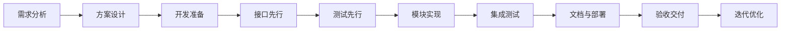

# AI Gateway MVP 开发流程文档

> 版本: 1.2
> 本文档描述从需求分析到最终交付的完整开发流程，定位为开发过程的导航地图。

---

## 1. 开发流程全景



---

## 2. 阶段总览

| 阶段 | 名称 | 核心任务 | 产出 | 状态 |
|------|------|---------|------|------|
| 一 | 需求分析 | 需求收集、分类、边界分析 | `docs/01-requirements-analysis.md` | ✅ 已完成 |
| 二 | 方案设计 | 技术选型、架构设计、数据模型 | `docs/02-design.md` | ✅ 已完成 |
| 三 | 开发准备 | 脚手架初始化、安装依赖、配置文件 | 可运行的 Go 项目骨架 | ✅ 已完成 |
| 四 | 接口先行 | 定义 Store/Service/Provider 接口 | 所有接口签名（含桩实现） | ✅ 已完成 |
| 五 | 测试先行 | 先写测试用例，再写实现（TDD 红绿循环） | `docs/03-testing-strategy.md` + 测试文件 | ✅ 已完成 |
| 六 | 模块实现 | 按依赖顺序实现所有模块，让测试变绿 | 全部功能代码 | ✅ 已完成 |
| 七 | 集成测试 | 完整链路验证、手动验证脚本 | 测试报告 + 验证脚本 | ✅ 已完成 |
| 八 | 文档与部署 | OpenAPI / README / Docker 构建 | `api/openapi.yaml` / `README.md` / 镜像 | ✅ 已完成 |
| 九 | 验收交付 | 按 checklist 逐项确认 | 交付物清单 | ✅ 已完成 |

---

## 3. 阶段一：需求分析

**参见** `docs/01-requirements-analysis.md`

---

## 4. 阶段二：方案设计

**参见** `docs/02-design.md`

---

## 5. 阶段三：开发准备

**目标：** 搭建可运行的项目骨架，配置开发环境。

**任务清单：**

| 任务 | 说明 |
|------|------|
| 初始化 Go module | `go mod init github.com/vrviu/ai-gateway` |
| 安装核心依赖 | chi router（路由）、mattn/go-sqlite3（数据库）、google/uuid（ID 生成） |
| 创建目录结构 | `cmd/server/`、`internal/{config,model,store,auth,proxy,usage,middleware,handler,router}/`、`web/` |
| 配置模板 | `.env.example`、`.gitignore` |
| 基础文件 | `Makefile`（build/test/run 命令） |
| 编译验证 | `go build ./...` 通过 |

---

## 6. 阶段四：接口先行

**核心原则：先定义契约，再写实现。** 这个阶段只定义接口签名和模型结构体，实现可以是空桩（stub），确保编译通过即可。

**目标：** 确保模块解耦和契约清晰。

**任务清单：**

| 层次 | 接口文件 | 核心接口 |
|------|---------|---------|
| 数据模型 | `internal/model/*.go` | Tenant / ApiKey / Usage 结构体 |
| 存储层 | `internal/store/` | TenantStore / ApiKeyStore / UsageStore（CRUD） |
| 认证层 | `internal/auth/service.go` | Service（ValidateKey / GenerateKey） |
| 代理层 | `internal/proxy/provider.go` | Provider（ChatCompletion / ListModels） |
| 用量层 | `internal/usage/recorder.go` | Recorder（Record / Flush） |

---

## 7. 阶段五：测试先行（先红后绿）

**核心原则：在写业务实现之前编写测试用例，建立 TDD 红绿循环。**

先写测试文件，确保测试能编译但会失败（红灯），这是 TDD 的起点。此时**不写业务逻辑实现代码**，只写测试代码和接口桩。

**任务清单：**

| 测试类型 | 测试文件 | 覆盖内容 |
|---------|----------|---------|
| 单元测试 | `auth/scope_test.go` | Scope 匹配（通配/精确/前缀/拒绝） |
| 单元测试 | `auth/service_test.go` | Key 认证全链路（有效/无效/禁用/过期） |
| 单元测试 | `proxy/mock_test.go` | Mock Provider 响应 |
| 集成测试 | `store/*_test.go` | 三个 Store 的 CRUD（真实 SQLite） |
| HTTP 测试 | `handler/*_test.go` | Handler 的 httptest |
| HTTP 测试 | `middleware/auth_test.go` | 认证中间件 |

**测试命名：** `Test{函数}_{场景}`，如 `TestScopeMatch_Wildcard`

---

## 8. 阶段六：模块实现（让测试变绿）

**目标：** 按依赖顺序实现所有模块，让测试从红变绿。

**实现顺序：**

```
Layer 1（基础）
  config.go → store/db.go

Layer 2（存储）
  tenant_store.go → apikey_store.go → usage_store.go

Layer 3（业务逻辑）
  auth/scope.go → auth/service.go → usage/recorder.go → proxy/mock.go

Layer 4（HTTP 层）
  middleware/auth.go → handler/response.go → handler/health.go
  handler/tenant.go → handler/apikey.go → handler/notimplemented.go

Layer 5（组装）
  router/router.go → cmd/server/main.go
```

---

## 9. 阶段七：集成测试

**目标：** 验证完整请求链路。

**任务清单：**

1. 运行全部测试：`go test ./... -v -count=1`
2. 编写手动验证脚本 `scripts/verify.sh`，覆盖：健康检查 → 创建租户 → 创建 Key → 代理请求 → 查询用量
3. 验证错误路径：401/403/400/502/504
4. 性能基线：代理请求 < 500ms，认证 < 10ms，100 QPS

---

## 10. 阶段八：文档与部署

**目标：** 完成交付所需的所有文档和部署配置。

**任务清单：**

| 产出物 | 说明 |
|--------|------|
| `api/openapi.yaml` | OpenAPI 3.1 规范，覆盖所有管理 API + 代理 API + 错误响应 |
| `README.md` | 快速开始、API 参考、配置说明、开发指南、设计决策 |
| Docker 镜像 | 最终构建验证 |
| `.env.example` | 环境变量模板 |

---

## 11. 阶段九：验收交付

**目标：** 按 checklist 逐项确认，完成交付。

**功能验收：**
- [x] 创建租户 → 201
- [x] 创建 Key → 返回完整 Key（仅一次）
- [x] 代理请求 → OpenAI 格式响应
- [x] 禁用/过期/权限不足 → 401/403
- [x] 健康检查 → 200

**非功能验收：**
- [x] `docker compose up` 一键启动成功
- [x] 服务启动 < 5 秒
- [x] 日志不包含敏感信息
- [x] 代码覆盖率 > 70%

---

## 12. 附录

### Git 提交格式

```
feat: 新功能
fix: 缺陷修复
docs: 文档变更
test: 测试相关
chore: 构建/工具链

示例：feat: implement tenant CRUD API
```

### 常用命令

| 命令 | 说明 |
|------|------|
| `go run ./cmd/server` | 本地启动 |
| `go test ./... -v -count=1` | 运行所有测试 |
| `go build ./...` | 编译所有包 |
| `docker compose up -d` | Docker 启动 |

---

## 文档版本记录

| 版本 | 日期 | 变更内容 |
|------|------|---------|
| 1.0 | 2026-07-07 | 初始版本 |
| 1.1 | 2026-07-07 | 更新阶段三五状态为已完成 |
| 1.2 | 2026-07-07 | 更新阶段总览顺序，拆分阶段三~五为独立章节，细化各阶段内容 |