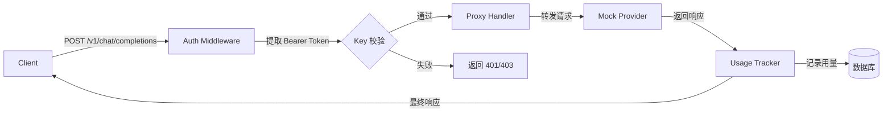
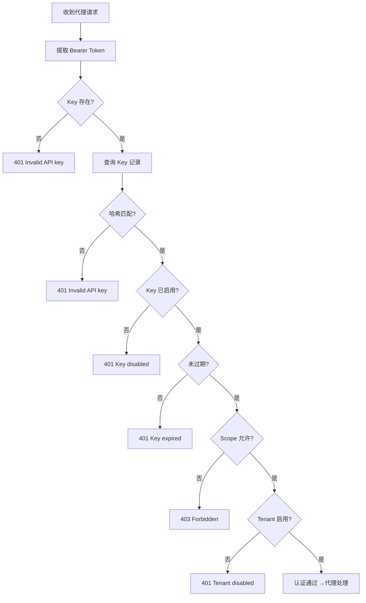

# AI Gateway MVP 需求分析文档

## 1. 项目背景

实现一个 AI Gateway MVP（最小可行产品），统一管理多租户的 API Key，代理 AI 模型请求到下游服务（可 mock），并记录用量数据。

### 核心目标
- 统一管理租户与 API Key 的生命周期
- 提供与 OpenAI 兼容的接口，作为 AI 模型请求的统一入口
- 追踪每个请求的用量数据
- 使用 Docker Compose 一键启动

---

## 2. 功能模块分解

### 2.0 整体请求流程

以下流程图展示了 AI Gateway 处理一个代理请求的完整链路：



### 2.1 租户与 Key 管理模块

#### 2.1.0 认证鉴权流程

以下流程图展示了 Key 认证的完整判断链路：



### 2.2 AI 代理模块

#### 2.1.1 租户（Tenant）管理
| 需求编号 | 需求描述 | 优先级 | 备注 |
|---------|---------|--------|------|
| T-001 | 支持创建租户 | P0 | 每个租户需有唯一标识和名称 |
| T-002 | 支持查询租户列表 | P0 | 分页查询 |
| T-003 | 支持查询单个租户详情 | P0 | 含该租户下的 Key 概览 |
| T-004 | 租户可被禁用/启用 | P1 | 禁用后该租户下所有 Key 失效 |
| T-005 | 支持删除租户 | P1 | 级联删除关联的 Key 和用量记录 |

#### 2.1.2 API Key 管理
| 需求编号 | 需求描述 | 优先级 | 备注 |
|---------|---------|--------|------|
| K-001 | 为租户创建多个 API Key | P0 | 每次创建返回完整 Key 值（仅此一次） |
| K-002 | 支持为 Key 设置名称/别名 | P0 | 便于管理识别 |
| K-003 | 支持为 Key 设置 Scope（权限范围） | P0 | Scope 建模见第 3 节 |
| K-004 | 支持启用/禁用 Key | P0 | 禁用的 Key 无法通过认证 |
| K-005 | 支持设置 Key 过期时间 | P0 | 过期 Key 自动失效 |
| K-006 | 支持查询租户下的所有 Key（不含完整 Key 值） | P0 | 返回部分信息如 Key 前缀 |
| K-007 | 支持删除 Key | P1 | 软删除或硬删除 |
| K-008 | Key 值采用安全哈希存储 | P0 | 哈希存储，不可逆 |

#### 2.1.3 认证与鉴权流程
| 需求编号 | 需求描述 | 优先级 | 备注 |
|---------|---------|--------|------|
| A-001 | 从请求头 `Authorization: Bearer <key>` 提取 Key | P0 | 标准 Bearer Token 认证 |
| A-002 | 校验 Key 是否存在 | P0 | 通过 Key 前缀查找候选 Key，验证哈希 |
| A-003 | 校验 Key 是否启用 | P0 | disabled 状态拒绝 |
| A-004 | 校验 Key 是否过期 | P0 | 超过 expires_at 拒绝 |
| A-005 | 校验 Key 是否有权限访问请求的模型 | P0 | Scope 匹配检查 |
| A-006 | 校验租户是否启用 | P0 | 租户被禁用的 Key 也拒绝 |

---

### 2.2 AI 代理模块

#### 2.2.1 接口兼容
| 需求编号 | 需求描述 | 优先级 | 备注 |
|---------|---------|--------|------|
| P-001 | 提供 `POST /v1/chat/completions` 接口 | P0 | 兼容 OpenAI 请求/响应格式 |
| P-002 | 提供 `GET /v1/models` 接口 | P0 | 返回可用模型列表 |
| P-003 | 请求体兼容 OpenAI 主流字段 | P0 | model, messages, temperature, max_tokens 等 |
| P-004 | 响应体兼容 OpenAI 格式 | P0 | id, object, model, choices, usage 等 |

#### 2.2.2 下游代理与 Mock
| 需求编号 | 需求描述 | 优先级 | 备注 |
|---------|---------|--------|------|
| M-001 | 将请求转发到下游 AI 服务 | P0 | 使用配置的下游地址 |
| M-002 | 内置 Mock Provider 作为默认下游 | P0 | 无需真实 AI 服务即可演示 |
| M-003 | Mock Provider 返回模拟的 Chat Completion 响应 | P0 | 含合理的 token 计数 |
| M-004 | Mock Provider 响应含可控延迟 | P1 | 模拟真实 AI 延迟 |
| M-005 | 支持配置多个下游 provider | P1 | 通过配置切换 |

#### 2.2.3 错误处理
| 需求编号 | 需求描述 | 优先级 | 备注 |
|---------|---------|--------|------|
| E-001 | Key 无效/不存在返回 401 | P0 | 响应体含错误信息 |
| E-002 | Key 已禁用返回 401 | P0 |  |
| E-003 | Key 已过期返回 401 | P0 |  |
| E-004 | Key 权限不足返回 403 | P0 | 明确提示缺少的权限 |
| E-005 | 下游服务不可达返回 502 | P0 | Bad Gateway |
| E-006 | 下游服务超时返回 504 | P0 | Gateway Timeout |
| E-007 | 下游返回错误状态码时合理封装返回 | P0 |  |
| E-008 | 请求体格式错误返回 400 | P0 | 含参数校验错误信息 |

---

### 2.3 用量追踪模块

#### 2.3.1 数据记录
| 需求编号 | 需求描述 | 优先级 | 备注 |
|---------|---------|--------|------|
| U-001 | 每次代理请求完成后记录用量 | P0 | 异步写入，不阻塞请求 |
| U-002 | 记录租户 ID | P0 | 关联到租户 |
| U-003 | 记录使用的 API Key ID | P0 | 关联到 Key |
| U-004 | 记录请求的模型名称 | P0 | 如 gpt-4, gpt-3.5-turbo |
| U-005 | 记录 prompt token 数 | P0 | 输入 token |
| U-006 | 记录 completion token 数 | P0 | 输出 token |
| U-007 | 记录 total token 数 | P0 | 总 token |
| U-008 | 记录请求时间戳 | P0 | 用于时间范围查询 |
| U-009 | 记录请求是否成功 | P0 | 区分成功和失败的调用 |
| U-010 | 记录错误码（如果有） | P1 | 失败原因 |
| U-011 | 记录来源 IP | P1 | 用于审计 |

#### 2.3.2 用量查询
| 需求编号 | 需求描述 | 优先级 | 备注 |
|---------|---------|--------|------|
| Q-001 | 按租户查询用量汇总 | P0 | 总调用次数、总 token |
| Q-002 | 按 Key 查询用量汇总 | P0 |  |
| Q-003 | 按时间范围筛选 | P0 | start_time, end_time |
| Q-004 | 按模型筛选 | P0 |  |
| Q-005 | 支持分页查询 | P0 |  |
| Q-006 | 支持同时查询多个维度 | P1 | 如某租户下某 Key 某模型的用量 |

---

### 2.4 OpenAPI 规范
| 需求编号 | 需求描述 | 优先级 | 备注 |
|---------|---------|--------|------|
| O-001 | 提供完整的 OpenAPI 3.x 规范文件 | P0 | YAML 格式 |
| O-002 | 规范文件与实现一致 | P0 | 覆盖所有管理 API |
| O-003 | 规范文件覆盖代理接口 | P0 | /v1/chat/completions, /v1/models |
| O-004 | 规范文件覆盖错误响应 | P0 | 401/403/502/504 |

---

### 2.5 Dashboard（选做）
| 需求编号 | 需求描述 | 优先级 | 备注 |
|---------|---------|--------|------|
| D-001 | 极简前端页面 | P1 | HTML/CSS/JS，不依赖前端框架 |
| D-002 | 租户列表与创建 | P1 |  |
| D-003 | Key 列表、创建、启用/禁用 | P1 |  |
| D-004 | 用量查看 | P1 | 简单列表展示 |

---

## 3. Scope 建模

### 3.1 什么是 Scope

**Scope 是 API Key 的权限边界，定义了该 Key 可以访问哪些模型。**

在实际场景中，不同 API Key 需要有不同的访问权限。如果不加 Scope 限制，一个 Key 泄露后可以访问所有资源，这是不安全的。

### 3.2 Scope 格式

采用 `resource:action/target` 三段式结构：

| 段 | 含义 | 当前取值 | 未来扩展 |
|----|------|----------|----------|
| resource | 资源类型 | `model` | embedding, image, audio |
| action | 操作类型 | `chat` | embedding, completion |
| target | 具体模型 | `gpt-4`, `*` | 随模型增加 |

### 3.3 Scope 值定义

| Scope 值 | 含义 | 使用场景 |
|----------|------|----------|
| `model:*` | 允许所有模型 | 超级 Key |
| `model:chat/gpt-4` | 仅 gpt-4 | 生产专用 Key |
| `model:chat/gpt-4:*` | gpt-4 所有版本 | 项目通用 Key |
| `model:chat/gpt-3.5-turbo` | 仅 gpt-3.5-turbo | 低成本测试 Key |

### 3.4 匹配规则

```
Key Scopes: ["model:*", "model:chat/gpt-3.5-turbo"]  请求 gpt-4
→ "model:*" 通配匹配 ✓ → 放行

Key Scopes: ["model:chat/gpt-3.5-turbo"]  请求 gpt-4
→ 不匹配 → 403 Forbidden
```

1. 通配匹配：`model:*` → 放行所有
2. 精确匹配：`model:chat/{model_name}` → 放行指定模型
3. 前缀匹配：`model:chat/gpt-4:*` → 放行 `gpt-4-32k` 等版本
4. 以上均不满足 → 403

### 3.5 存储与默认值

- **存储**：JSON 数组存入数据库 `scopes` 字段
- **默认值**：创建时未指定，默认 `["model:*"]`
- **查询返回**：返回 scope 信息（不返回完整 Key 值）

---

## 4. 非功能需求

| 需求编号 | 需求描述 | 优先级 | 说明 |
|---------|---------|--------|------|
| N-001 | 使用 Docker Compose 一键启动 | P0 | docker compose up 即可运行 |
| N-002 | 使用 Go 语言实现 | P0 | 作为 Go 项目 |
| N-003 | API Key 安全存储 | P0 | 哈希存储，明文仅创建时返回一次 |
| N-004 | 支持跨域（CORS） | P1 | 便于 Dashboard 开发和调试 |
| N-005 | 请求日志记录 | P1 | 基础访问日志 |
| N-006 | 合理的内存和磁盘使用 | P1 | 使用嵌入式数据库，零外部依赖 |

---

## 5. 已知约束与假设

### 5.1 约束
- 使用 Go 语言开发
- 使用 Docker Compose 部署
- API Key 使用 Bearer Token 方式
- 使用数据库持久化存储

### 5.2 假设
- MVP 阶段不考虑高并发场景
- MVP 阶段不考虑数据分片和水平扩展
- 下游 AI 服务由 Mock Provider 模拟
- 不实现 Rate Limiting（频率限制）
- 不实现 TLS（演示环境使用 HTTP，生产需前置反向代理）
- Dashboard 为极简实现，无复杂可视化

---

## 6. 需求优先级总结

### P0（必须实现）- MVP 核心功能
- 租户创建、查询
- Key 创建、查询、启用/禁用、设置 Scope 和过期时间
- Key 认证鉴权（存在性、状态、过期、Scope）
- OpenAI 兼容接口 (`POST /v1/chat/completions`, `GET /v1/models`)
- Mock Provider
- 错误处理（401/403/502/504）
- 用量记录与查询
- OpenAPI 规范文件
- Docker Compose 一键部署

### P1（选做）- 增强功能
- 租户禁用/删除
- Key 删除
- Dashboard 前端页面
- 请求延迟模拟
- CORS 支持
- 请求日志
- 多 Provider 配置支持

---

## 7. 边界情况

| 场景 | 预期处理 |
|------|---------|
| 空请求体调用 /v1/chat/completions | 返回 400 Bad Request |
| 请求中 model 字段缺失 | 返回 400 Bad Request |
| 请求中 messages 字段为空或格式错误 | 返回 400 Bad Request |
| Authorization 头缺失 | 返回 401 Unauthorized |
| Authorization 格式错误（非 Bearer） | 返回 401 Unauthorized |
| Key 值格式错误（长度不符） | 返回 401 Unauthorized |
| 同时有多个 Scope 匹配规则冲突 | 按最宽松的匹配（有一个允许即放行） |
| 创建 Key 时不指定过期时间 | 永不过期（null） |
| 用量查询返回空结果 | 返回空列表，不报错 |
| 代理目标 URL 配置错误 | 启动时验证配置，无效则返回 502 |

---

## 8. 交付物清单

1. **Go 源码项目** - 完整实现上述功能
2. **Dockerfile** - 多阶段构建，产出最小镜像
3. **docker-compose.yml** - 一键启动配置
4. **OpenAPI 3.x 规范** - YAML 文件
5. **README** - 架构说明、运行步骤（含 curl 示例）、设计决策、已知限制
6. **Dashboard 页面**（选做） - 极简前端
7. **需求分析文档** - 本文档