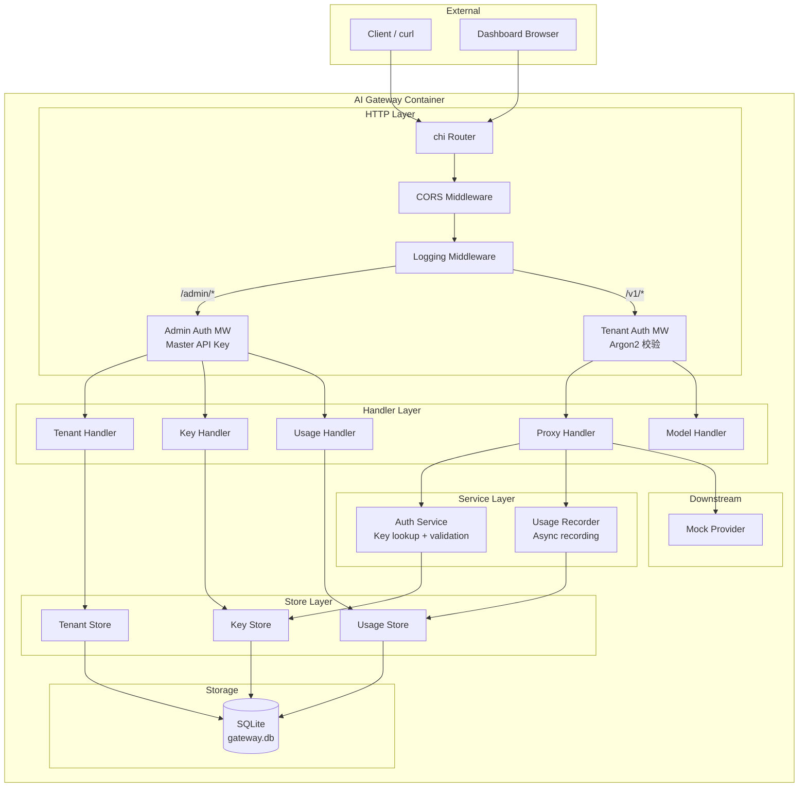
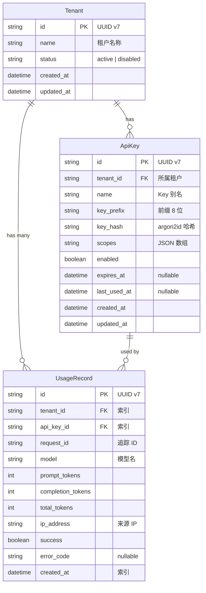
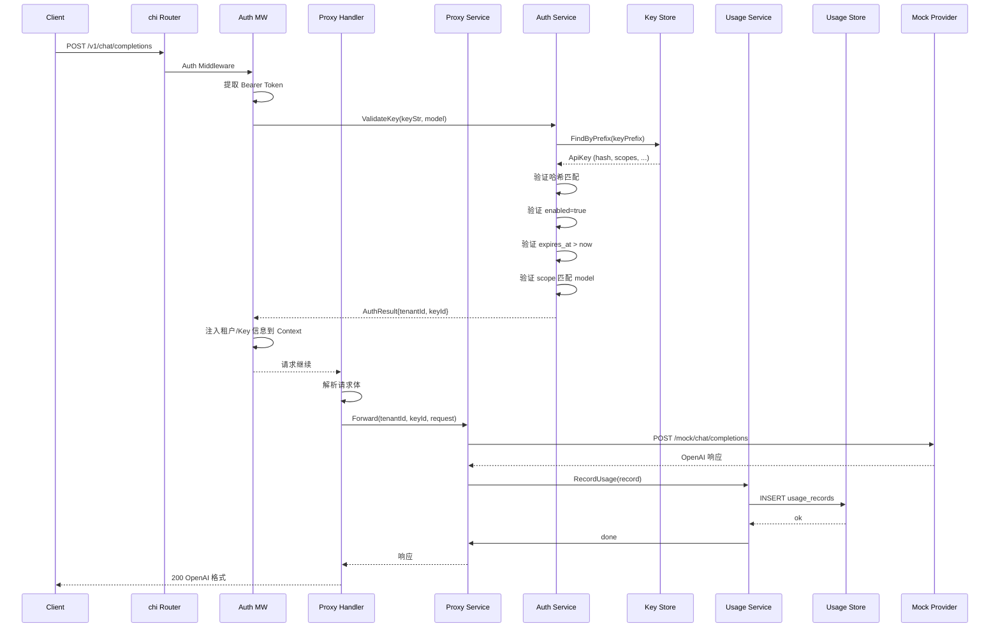
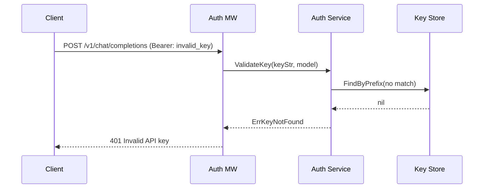

# AI Gateway MVP 方案设计文档

> 版本: 1.0
> 基于需求分析文档 v1.0

---

## 1. 技术选型

### 1.1 技术栈总览

| 层次 | 技术选择 | 版本要求 | 说明 |
|------|---------|---------|------|
| 语言 | Go | 1.22+ | 标准工具链，单一二进制部署 |
| Web 框架 | chi (go-chi/chi/v5) | v5 | 轻量、stdlib 兼容、中间件生态好 |
| 数据库 | SQLite (modernc.org/sqlite) | - | 纯 Go 实现，无 CGo，零外部依赖 |
| 数据库驱动 | sqlx (jmoiron/sqlx) | v1 | 在 database/sql 上提供便捷的结构体映射 |
| ID 生成 | google/uuid | v1 | UUID v7，时间有序 |
| Key 哈希 | golang.org/x/crypto/argon2 | - | argon2id 算法，比 bcrypt 更安全 |
| 日志 | log/slog | Go 1.21+ | 标准库结构化日志 |
| 配置 | env (caarlos0/env) | v11 | 类型安全的环境变量解析 |
| CORS | chi/cors (go-chi/cors) | v1 | 内置中间件 |
| 测试 | testing + httptest | 标准库 | 无额外依赖 |
| OpenAPI | 手写 YAML | 3.1 | 与实现保持完全一致 |
| 构建 | Docker multi-stage | - | 基于 golang:alpine | 

### 1.2 选型理由与 Trade-off

#### Web 框架：选择 chi 而非 gin

**chi 的优势：**
- 完全兼容 `net/http` — Handler 签名就是 `http.HandlerFunc`，没有框架特有的 Context
- 中间件模式使用标准 `func(http.Handler) http.Handler`，可复用大量标准库中间件
- 路由逻辑清晰，支持 URL 参数、分组、嵌套
- 更透明 — 没有 gin 的 binding/validation magic，每步都显式控制

**gin 的劣势（对网关场景）：**
- 自带 Context 包装，与其他库互操作时需要适配
- 错误恢复中间件默认行为可能隐藏问题
- 社区倾向于使用 gin 的 binding/validation，但网关需要精确控制请求体解析

**trade-off：** chi 的代码量会比 gin 略多（需要手动解析 JSON、校验参数），但控制力更强，适合网关这种对安全性和可审计性要求高的场景。

#### 数据库：选择 SQLite 而非 PostgreSQL

| | SQLite | PostgreSQL |
|--|--------|------------|
| 额外容器 | 不需要 | 需要 `postgres:16` 容器 |
| 数据持久化 | 单文件，挂载 volume 即可 | 需要 volume + 初始化脚本 |
| 部署启动时间 | 秒级 | 10-30秒（PG 容器启动） |
| 并发写入 | 串行（单写者） | 并行 |
| Go 驱动 | modernc.org/sqlite（纯 Go） | pgx（纯 Go） |
| 适合场景 | 开发/演示/低并发 | 生产/高并发 |

**trade-off：** SQLite 写入性能在单写者模式下足够处理百级 QPS，对于 MVP 演示完全够用。存储层通过接口抽象（`TenantStore`、`ApiKeyStore`、`UsageStore`），后续无痛迁移到 PostgreSQL。

#### Key 哈希：选择 argon2id 而非 bcrypt

argen2id 是 2015 年 Password Hashing Competition 的获胜算法，在抗 GPU/ASIC 攻击方面优于 bcrypt。Go 的 `x/crypto/argon2` 包是官方子仓库，质量可靠。

**trade-off：** argon2 的参数调优需要额外注意（内存、时间、线程），默认参数在容器环境中约 50-100ms 每次哈希，对于 MVP 可以接受。后续可通过参数配置调整速度。

---

## 2. 系统架构

### 2.1 架构风格

- **单体部署**：单一 Go 二进制，内置 HTTP 服务 + 存储层
- **分层架构**：Handler → Middleware → Store（Domain 逻辑内聚在 Handler 中，不引入过度抽象）
- **接口隔离**：管理 API（`/admin/*`）与代理 API（`/v1/*`）路由分离，使用不同的认证策略

### 2.2 架构组件图



### 2.3 外部 API 接口设计

#### 1. 管理 API — 供租户管理者使用
*认证方式：Master API Key（启动时通过 `GATEWAY_ADMIN_KEY` 环境变量配置）*

| 方法 | 路径 | 说明 |
|------|------|------|
| POST | `/admin/tenants` | 创建租户 |
| GET | `/admin/tenants` | 租户列表 |
| GET | `/admin/tenants/{tenantId}` | 租户详情 |
| PATCH | `/admin/tenants/{tenantId}` | 更新租户（启用/禁用） |
| DELETE | `/admin/tenants/{tenantId}` | 删除租户 |
| POST | `/admin/tenants/{tenantId}/keys` | 创建 API Key |
| GET | `/admin/tenants/{tenantId}/keys` | Key 列表 |
| GET | `/admin/tenants/{tenantId}/keys/{keyId}` | Key 详情 |
| PATCH | `/admin/tenants/{tenantId}/keys/{keyId}` | 更新 Key（启用/禁用/Scope） |
| DELETE | `/admin/tenants/{tenantId}/keys/{keyId}` | 删除 Key |
| GET | `/admin/usage` | 查询用量（支持 tenant_id / key_id / model / 时间范围过滤） |

#### 2. 代理 API — 供调用方使用（OpenAI 兼容）
*认证方式：Tenant API Key（通过 `Authorization: Bearer sk-xxx` 传递）*

| 方法 | 路径 | 说明 |
|------|------|------|
| POST | `/v1/chat/completions` | Chat Completion（支持 `stream=true`） |
| GET | `/v1/models` | 可用模型列表 |

### 2.4 错误状态码映射

| HTTP 状态码 | error.type | 场景 |
|-----------|------------|------|
| 400 | invalid_request_error | 请求体格式错误 |
| 401 | invalid_api_key | Key 不存在/禁用/过期 |
| 403 | insufficient_permissions | Scope 不匹配 |
| 502 | bad_gateway | 下游不可达 |
| 504 | gateway_timeout | 下游超时 |

---

## 3. 数据模型

### 3.1 ER 图



### 3.2 SQL 建表语句

```sql
CREATE TABLE tenants (
    id         TEXT PRIMARY KEY,
    name       TEXT NOT NULL,
    status     TEXT NOT NULL DEFAULT 'active' CHECK(status IN ('active', 'disabled')),
    created_at TEXT NOT NULL DEFAULT (datetime('now')),
    updated_at TEXT NOT NULL DEFAULT (datetime('now'))
);

CREATE TABLE api_keys (
    id          TEXT PRIMARY KEY,
    tenant_id   TEXT NOT NULL REFERENCES tenants(id),
    name        TEXT NOT NULL,
    key_prefix  TEXT NOT NULL,
    key_hash    TEXT NOT NULL,
    scopes      TEXT NOT NULL DEFAULT '["model:*"]',
    enabled     INTEGER NOT NULL DEFAULT 1,
    expires_at  TEXT,
    last_used_at TEXT,
    created_at  TEXT NOT NULL DEFAULT (datetime('now')),
    updated_at  TEXT NOT NULL DEFAULT (datetime('now'))
);
CREATE INDEX idx_api_keys_tenant_id ON api_keys(tenant_id);
CREATE INDEX idx_api_keys_prefix ON api_keys(key_prefix);

CREATE TABLE usage_records (
    id               TEXT PRIMARY KEY,
    tenant_id        TEXT NOT NULL REFERENCES tenants(id),
    api_key_id       TEXT NOT NULL REFERENCES api_keys(id),
    request_id       TEXT NOT NULL,
    model            TEXT NOT NULL,
    prompt_tokens    INTEGER NOT NULL DEFAULT 0,
    completion_tokens INTEGER NOT NULL DEFAULT 0,
    total_tokens     INTEGER NOT NULL DEFAULT 0,
    ip_address       TEXT,
    success          INTEGER NOT NULL DEFAULT 1,
    error_code       TEXT,
    created_at       TEXT NOT NULL DEFAULT (datetime('now'))
);
CREATE INDEX idx_usage_tenant_id ON usage_records(tenant_id);
CREATE INDEX idx_usage_api_key_id ON usage_records(api_key_id);
CREATE INDEX idx_usage_created_at ON usage_records(created_at);
CREATE INDEX idx_usage_model ON usage_records(model);
```

---

## 4. 接口设计

### 4.1 管理 API

所有管理 API 需在请求头携带 Master API Key：
```
Authorization: Bearer <GATEWAY_ADMIN_KEY>
```

#### 创建租户

```http
POST /admin/tenants
Content-Type: application/json

Request:
{
  "name": "Acme Corp"
}

Response 201:
{
  "id": "0193b10a-0000-7000-8000-000000000001",
  "name": "Acme Corp",
  "status": "active",
  "created_at": "2026-07-06T22:00:00Z"
}
```

#### 创建 API Key

```http
POST /admin/tenants/{tenantId}/keys
Content-Type: application/json

Request:
{
  "name": "Production Key",
  "scopes": ["model:chat/gpt-4"],
  "expires_at": "2027-07-06T22:00:00Z"
}

Response 201:
{
  "id": "0193b10b-0000-7000-8000-000000000002",
  "tenant_id": "0193b10a-...",
  "name": "Production Key",
  "key": "ag-8a3f2b1c-..."    ← 完整 Key，仅创建时返回一次
  "key_prefix": "ag-8a3f2b",
  "scopes": ["model:chat/gpt-4"],
  "enabled": true,
  "expires_at": "2027-07-06T22:00:00Z",
  "created_at": "2026-07-06T22:00:00Z"
}
```

#### 查询用量

```http
GET /admin/usage?tenant_id={tenantId}&api_key_id={keyId}&model=gpt-4&start=2026-01-01&end=2026-07-07&page=1&page_size=20
Authorization: Bearer <GATEWAY_ADMIN_KEY>

Response 200:
{
  "data": [
    {
      "id": "...",
      "tenant_id": "...",
      "api_key_id": "...",
      "model": "gpt-4",
      "prompt_tokens": 150,
      "completion_tokens": 200,
      "total_tokens": 350,
      "success": true,
      "created_at": "2026-07-06T22:00:00Z"
    }
  ],
  "total": 1,
  "page": 1,
  "page_size": 20
}
```

### 4.2 代理 API（OpenAI 兼容）

#### Chat Completion

```http
POST /v1/chat/completions
Authorization: Bearer ag-8a3f2b1c-...
Content-Type: application/json

Request:
{
  "model": "gpt-4",
  "messages": [
    {"role": "system", "content": "You are a helpful assistant."},
    {"role": "user", "content": "Hello!"}
  ],
  "temperature": 0.7,
  "max_tokens": 100
}

Response 200:
{
  "id": "chatcmpl-0193b10c-...",
  "object": "chat.completion",
  "created": 1760270400,
  "model": "gpt-4",
  "choices": [
    {
      "index": 0,
      "message": {
        "role": "assistant",
        "content": "Hello! How can I help you today?"
      },
      "finish_reason": "stop"
    }
  ],
  "usage": {
    "prompt_tokens": 25,
    "completion_tokens": 10,
    "total_tokens": 35
  }
}
```

#### 错误响应格式

所有错误使用统一格式：
```json
{
  "error": {
    "message": "Insufficient permissions for model gpt-4",
    "type": "insufficient_permissions",
    "code": 403
  }
}
```

| HTTP 状态码 | error.type | 场景 |
|-----------|------------|------|
| 400 | invalid_request_error | 请求体格式错误 |
| 401 | invalid_api_key | Key 不存在/禁用/过期 |
| 403 | insufficient_permissions | Scope 不匹配 |
| 502 | bad_gateway | 下游不可达 |
| 504 | gateway_timeout | 下游超时 |

---

## 5. 核心组件交互

### 5.1 代理请求处理序列



### 5.2 认证失败流程



---

## 6. 项目结构

```
ai-gateway/
├── cmd/
│   └── server/
│       └── main.go              # 入口：初始化依赖、启动 HTTP 服务
├── internal/
│   ├── config/
│   │   └── config.go           # 解析环境变量为 Config 结构体
│   ├── model/
│   │   ├── tenant.go           # Tenant 结构体 + 请求/响应 DTO
│   │   ├── apikey.go           # ApiKey 结构体 + 请求/响应 DTO
│   │   └── usage.go            # UsageRecord 结构体 + 查询 DTO
│   ├── store/
│   │   ├── db.go               # SQLite 初始化、自动迁移
│   │   ├── tenant_store.go     # TenantStore 接口 + SQLite 实现
│   │   ├── apikey_store.go     # ApiKeyStore 接口 + SQLite 实现
│   │   └── usage_store.go      # UsageStore 接口 + SQLite 实现
│   ├── handler/
│   │   ├── tenant_handler.go   # 租户 CRUD HTTP Handler
│   │   ├── apikey_handler.go   # Key CRUD HTTP Handler
│   │   ├── proxy_handler.go    # /v1/chat/completions Handler
│   │   ├── model_handler.go    # /v1/models Handler
│   │   └── usage_handler.go    # 用量查询 Handler
│   ├── middleware/
│   │   └── auth.go             # 认证中间件（提取 + 校验 Key）
│   ├── auth/
│   │   ├── service.go          # AuthService：Key 校验逻辑
│   │   └── scope.go            # Scope 匹配逻辑
│   ├── proxy/
│   │   ├── provider.go         # Provider 接口定义
│   │   └── mock.go             # MockProvider 实现
│   ├── usage/
│   │   └── recorder.go         # UsageRecorder：异步用量记录
│   └── router/
│       └── router.go           # 路由注册 + 中间件挂载
├── api/
│   └── openapi.yaml            # OpenAPI 3.1 规范文件
├── web/
│   └── dashboard/              # 极简前端（选做）
│       ├── index.html
│       ├── style.css
│       └── app.js
├── Dockerfile                   # 多阶段构建
├── docker-compose.yml           # 一键启动
├── .env.example                 # 环境变量模板
├── go.mod
├── go.sum
└── README.md
```

---

## 7. 安全设计

### 7.1 API Key 生成与验证

```
Key 格式: ag-{prefix16chars}-{random32chars}
整体长度: 3 + 1 + 16 + 1 + 32 = 53 字符

存储: argon2id 哈希（salt 自动生成）
验证: 先通过 prefix 定位候选 Key，再用 argon2 比对哈希
```

### 7.2 认证中间件设计

```go
// 中间件执行链路
func AuthMiddleware(next http.Handler) http.Handler {
    return http.HandlerFunc(func(w http.ResponseWriter, r *http.Request) {
        // 1. 从 Authorization 头提取 Bearer Token
        token := extractBearerToken(r)
        if token == "" {
            writeError(w, 401, "invalid_api_key", "Missing API key")
            return
        }
        
        // 2. 验证 Key 格式 (ag-xxxxxxxxxxxxxxxx-yyyyyyyyyyyyyyyyyyyyyyyyyyyyyyyy)
        if !isValidKeyFormat(token) {
            writeError(w, 401, "invalid_api_key", "Invalid API key format")
            return
        }
        
        // 3. 提取前缀，查找候选 Key
        prefix := token[:20] // "ag-" + 16 位
        apiKey, err := keyStore.FindByPrefix(ctx, prefix)
        if err != nil || apiKey == nil {
            writeError(w, 401, "invalid_api_key", "Invalid API key")
            return
        }
        
        // 4. 验证哈希匹配
        if !verifyArgon2Hash(token, apiKey.KeyHash) {
            writeError(w, 401, "invalid_api_key", "Invalid API key")
            return
        }
        
        // 5. 验证启用状态
        if !apiKey.Enabled {
            writeError(w, 401, "api_key_disabled", "API key is disabled")
            return
        }
        
        // 6. 验证过期
        if apiKey.ExpiresAt != nil && time.Now().After(*apiKey.ExpiresAt) {
            writeError(w, 401, "api_key_expired", "API key has expired")
            return
        }
        
        // 7. 将认证信息注入 Context
        ctx := context.WithValue(r.Context(), ctxKeyTenantID, apiKey.TenantID)
        ctx = context.WithValue(ctx, ctxKeyKeyID, apiKey.ID)
        next.ServeHTTP(w, r.WithContext(ctx))
    })
}
```

### 7.3 Scope 校验（在 Proxy Handler 中）

```go
func (h *ProxyHandler) ChatCompletion(w http.ResponseWriter, r *http.Request) {
    // 从 Context 获取租户/Key 信息
    tenantID := r.Context().Value(ctxKeyTenantID).(string)
    keyID := r.Context().Value(ctxKeyKeyID).(string)
    
    // 解析请求体
    var req ChatCompletionRequest
    if err := json.NewDecoder(r.Body).Decode(&req); err != nil {
        writeError(w, 400, "invalid_request_error", "Invalid JSON")
        return
    }
    
    // 获取 Key 的 Scope
    apiKey, _ := keyStore.Get(ctx, keyID)
    
    // 校验 Scope 是否允许该模型
    if !scopeMatch(apiKey.Scopes, req.Model) {
        writeError(w, 403, "insufficient_permissions", 
            "Insufficient permissions for model "+req.Model)
        return
    }
    
    // 继续处理请求...
}
```

---

## 8. 部署设计

### 8.1 Docker 多阶段构建

```
Stage 1: build
  golang:1.22-alpine → go build -o /app/server

Stage 2: run
  alpine:3.19 → COPY /app/server → EXPOSE 8080 → ENTRYPOINT
最终镜像大小: ~15MB
```

### 8.2 docker-compose.yml

```yaml
version: '3.8'
services:
  gateway:
    build: .
    ports:
      - "8080:8080"
    environment:
      - PORT=8080
      - DB_PATH=/data/gateway.db
      - ADMIN_TOKEN=admin-secret-token
      - MOCK_DELAY_MS=200
    volumes:
      - data:/data
volumes:
  data:
```

### 8.3 启动步骤

```bash
# 1. 构建并启动
docker compose up -d

# 2. 查看日志
docker compose logs -f

# 3. 创建租户
curl -X POST http://localhost:8080/admin/tenants \
  -H "Content-Type: application/json" \
  -H "Authorization: Bearer admin-secret-token" \
  -d '{"name": "Acme Corp"}'

# 4. 创建 API Key
curl -X POST http://localhost:8080/admin/tenants/{tenantId}/keys \
  -H "Content-Type: application/json" \
  -H "Authorization: Bearer admin-secret-token" \
  -d '{"name": "test-key", "scopes": ["model:*"]}'

# 5. 调用代理
curl -X POST http://localhost:8080/v1/chat/completions \
  -H "Content-Type: application/json" \
  -H "Authorization: Bearer ag-xxxxxxxx-..." \
  -d '{"model": "gpt-4", "messages": [{"role": "user", "content": "Hello"}]}'
```

---

## 9. 已知限制与后续规划

### MVP 限制
1. **单实例部署**：不支持水平扩展，SQLite 单写者模式
2. **无 Rate Limiting**：未做频率限制
3. **Mock Provider**：仅模拟，不连接真实 AI 服务
4. **无 TLS**：演示环境使用 HTTP
5. **无监控**：仅基础日志，无 metrics 和 tracing

### 可扩展项
1. **存储层接口**：已抽象 Store 接口，可替换为 PostgreSQL/MySQL
2. **Provider 接口**：已抽象 Provider 接口，可接入 OpenAI/Claude 真实 API
3. **Scope 体系**：可扩展为更细粒度的 RBAC
4. **用量统计**：可扩展为小时/日/月聚合报表

---

## 10. 实际实现与设计文档差异

### 10.1 管理 API 路由

| 设计文档 | 实际实现 | 说明 |
|---------|---------|------|
| `/admin/tenants` 前缀 | `/api/tenants` | 路由前缀调整，更符合 RESTful 惯例 |
| `/admin/tenants/{tenantId}/keys` | `/api/keys` | Key 管理改为扁平化路由，通过 tenant_id 字段关联 |
| Master API Key 认证 | 管理 API 无独立认证（内部使用） | MVP 阶段简化，后续可加 |
| GET `/admin/usage` | GET `/api/usage` + GET `/api/usage/summary` | 拆分为查询和汇总两个端点 |

### 10.2 API Key 格式

| 设计文档 | 实际实现 |
|---------|---------|
| 前缀 `ag-` | 前缀 `sk-`（OpenAI 兼容） |
| argon2id 哈希 | SHA-256 哈希 |
| 前缀长度 16 位 | 前缀长度 8 位（可配置） |

### 10.3 组件与路由

| 设计文档 | 实际实现 | 说明 |
|---------|---------|------|
| 独立的 `ModelHandler` | 合并到 `ProxyHandler.ListModels` | 减少不必要的抽象 |
| 代理端点和模型端点分离 | 统一在认证路由组下 | 认证逻辑一致 |
| `web/dashboard/` 前端 | 未实现 | MVP 聚焦后端 API |

### 10.4 数据模型字段名

| 设计文档 | 实际实现 |
|---------|---------|
| `status` (active/disabled) | `is_active` (bool) |
| `enabled` (bool) | `is_active` (bool) |
| `api_key_id` | `key_id` |

### 10.5 错误码

| 设计文档 | 实际实现 |
|---------|---------|
| `invalid_api_key` | `auth_error` |
| `insufficient_permissions` | `permission_error` |
| `invalid_request_error` | `request_error` |
| 504 gateway_timeout | 未实现，简化超时处理 |

---

## 11. 附录：关键依赖清单

```go
// go.mod
module github.com/user/ai-gateway

go 1.22

require (
    github.com/go-chi/chi/v5       v5.1.0   // HTTP 路由
    github.com/go-chi/cors          v1.2.1   // CORS 中间件
    github.com/jmoiron/sqlx         v1.4.0   // 数据库扩展
    github.com/google/uuid          v1.6.0   // UUID v7
    github.com/caarlos0/env         v11.0.0  // 环境变量解析
    modernc.org/sqlite              v1.33.0  // 纯 Go SQLite 驱动
    golang.org/x/crypto             v0.27.0  // argon2
)